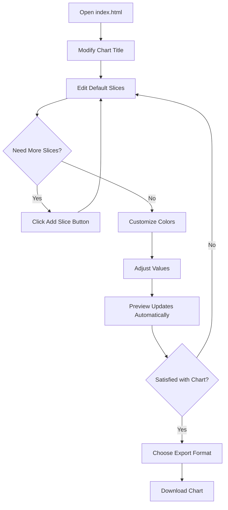
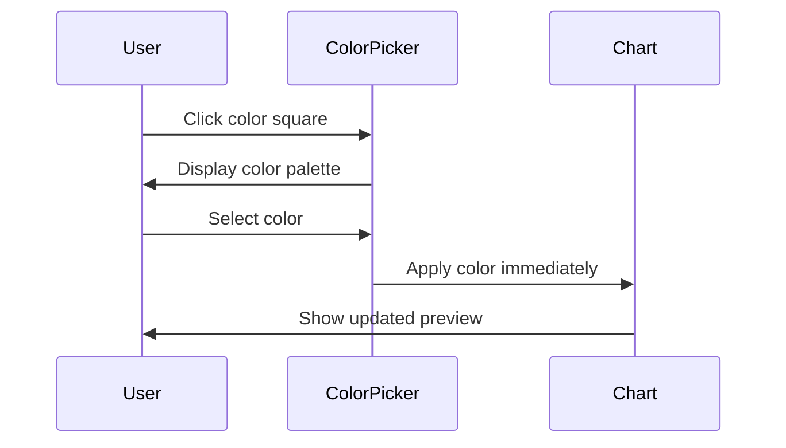
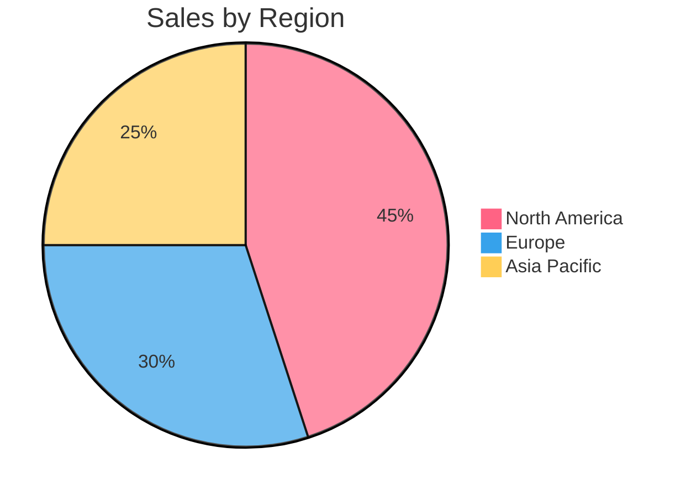
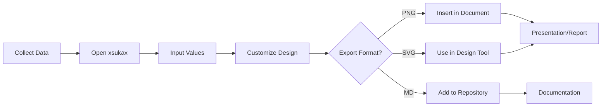

# xsukax Pie Chart Maker

[](https://www.gnu.org/licenses/gpl-3.0)
[](https://github.com/xsukax/xsukax-Pie-Chart-Maker)

A professional, user-friendly web application for creating beautiful pie charts without writing any code. Built with modern web technologies and designed with privacy and security as core principles.


## 📊 Project Overview

**xsukax Pie Chart Maker** is a client-side web application that empowers users to create, customize, and export professional pie charts through an intuitive visual interface. Unlike traditional chart creation tools that require coding knowledge or complex software installations, this application provides a streamlined, accessible solution for anyone needing to visualize data proportions quickly and effectively.

The application leverages Mermaid.js for chart rendering and Bootstrap for a responsive, modern user interface, all contained within a single HTML file that runs entirely in your browser. This architecture ensures maximum portability, ease of deployment, and complete user privacy.

### Core Capabilities

- **Visual Chart Builder**: Create pie charts using intuitive form controls—no coding required
- **Real-Time Preview**: See your chart update instantly as you make changes
- **Custom Color Selection**: Choose exact colors for each slice using visual color pickers
- **Multiple Export Formats**: Save charts as high-resolution PNG (with transparent backgrounds), SVG, or Markdown files
- **Responsive Design**: Works seamlessly across desktop, tablet, and mobile devices
- **Zero Installation**: Runs directly in any modern web browser

## 🔒 Security and Privacy Benefits

The xsukax Pie Chart Maker implements a **privacy-first, security-by-design** architecture that ensures complete user data protection:

### Client-Side Processing
All chart creation, rendering, and export operations occur entirely within your web browser. No data is ever transmitted to external servers, eliminating risks associated with data interception, server breaches, or unauthorized access.

### No Data Collection
The application does not collect, store, or transmit any user data, analytics, or telemetry. Your chart designs, titles, values, and customizations remain exclusively on your local device.

### No Authentication Required
There are no user accounts, logins, or registration processes that could expose personal information or create security vulnerabilities through credential theft or session hijacking.

### Transparent Single-File Architecture
The entire application exists in one HTML file (`index.html`) with inline JavaScript and CSS. This transparency allows security-conscious users to audit the complete codebase easily, verifying that no malicious code or tracking mechanisms are present.

### Offline Capability
Once the page is loaded, the application functions fully offline (except for initial CDN resource loading). This eliminates dependency on external services and protects against network-based attacks or service disruptions.

### Content Security
- External resources (Bootstrap, Mermaid.js, Bootstrap Icons) are loaded from reputable CDNs
- No third-party analytics or tracking scripts
- No cookies or local storage usage that could track user behavior
- No form submissions to external endpoints

### Export Security
Exported files (PNG, SVG, MD) are generated locally using browser APIs and contain only the chart data you explicitly created—no metadata, tracking information, or hidden data is embedded.

## ✨ Features and Advantages

### Key Features

1. **Intuitive Visual Interface**
   - Clean, modern design with gradient aesthetics
   - Drag-free color selection with native color pickers
   - Real-time input validation and feedback
   - Responsive layout optimized for all screen sizes

2. **Flexible Chart Customization**
   - Custom chart titles
   - Unlimited slice additions (practical limit based on readability)
   - Individual label editing for each slice
   - Precise numeric value input (supports decimals)
   - Per-slice color customization with visual color pickers
   - Automatic legend generation with matching colors

3. **Professional Export Options**
   - **PNG Export**: High-resolution (3× scale) with transparent backgrounds for professional presentations
   - **SVG Export**: Vector format for infinite scalability without quality loss
   - **Markdown Export**: Includes Mermaid syntax with color preservation for GitHub, Notion, and other Markdown-compatible platforms

4. **User Experience Excellence**
   - Toast notifications for user feedback (no intrusive alerts)
   - Loading indicators during chart rendering
   - Hover effects and smooth transitions
   - Minimum slice requirements prevent invalid charts
   - Smart default values to get started quickly

### Advantages Over Alternatives

| Feature | xsukax Pie Chart Maker | Traditional Tools | Online Services |
|---------|----------------------|-------------------|-----------------|
| Privacy | ✅ Complete (client-side) | ⚠️ Varies | ❌ Data uploaded to servers |
| Installation | ✅ None required | ❌ Software installation | ✅ None required |
| Cost | ✅ Free, open-source | ⚠️ Often paid | ⚠️ Freemium models |
| Offline Use | ✅ Yes (after initial load) | ✅ Yes | ❌ Requires internet |
| Code Required | ✅ No | ⚠️ Sometimes | ✅ No |
| Customization | ✅ Full color control | ✅ Varies | ⚠️ Limited in free tiers |
| Export Quality | ✅ High-res, transparent PNG | ✅ Varies | ⚠️ Often watermarked |
| Open Source | ✅ Yes (GPL v3) | ❌ Usually proprietary | ❌ Proprietary |

## 🚀 Installation Instructions

### Method 1: Direct Browser Use (Recommended)

1. **Download the Application**
   ```bash
   wget https://raw.githubusercontent.com/xsukax/xsukax-Pie-Chart-Maker/main/index.html
   ```
   Or manually download `index.html` from the [GitHub repository](https://github.com/xsukax/xsukax-Pie-Chart-Maker).

2. **Open in Browser**
   - Double-click `index.html` to open it in your default browser, or
   - Right-click → Open With → Select your preferred browser
   - Supported browsers: Chrome, Firefox, Safari, Edge (latest versions)

### Method 2: Clone Repository

```bash
# Clone the repository
git clone https://github.com/xsukax/xsukax-Pie-Chart-Maker.git

# Navigate to the directory
cd xsukax-Pie-Chart-Maker

# Open index.html in your browser
open index.html  # macOS
xdg-open index.html  # Linux
start index.html  # Windows
```

### Method 3: Local Web Server (Optional)

For development or testing purposes:

```bash
# Using Python 3
python -m http.server 8000

# Using Node.js http-server
npx http-server -p 8000

# Access at http://localhost:8000
```

### System Requirements

- **Operating System**: Windows 7+, macOS 10.10+, Linux (any modern distribution)
- **Browser**: Chrome 90+, Firefox 88+, Safari 14+, Edge 90+
- **Internet Connection**: Required only for initial CDN resource loading (Bootstrap, Mermaid.js)
- **Disk Space**: < 1 MB
- **Permissions**: None required (runs in browser sandbox)

## 📖 Usage Guide

### Quick Start Workflow



### Step-by-Step Instructions

#### 1. Creating Your First Chart

1. **Open the Application**
   - Launch `index.html` in your web browser
   - The application loads with a default 5-slice example chart

2. **Set Chart Title**
   - Locate the "Chart Title" input field in the left panel
   - Click and type your desired title (e.g., "Q4 Sales Distribution")
   - The preview updates automatically

3. **Configure Slices**
   - Each slice has four controls:
     - **Color Picker**: Click the colored square to select a custom color
     - **Label Input**: Enter descriptive text (e.g., "Product A", "Marketing")
     - **Value Input**: Enter numeric value (decimals supported)
     - **Delete Button**: Remove the slice (disabled if only 2 slices remain)

4. **Add or Remove Slices**
   - Click the **"+ Add Slice"** button to create new slices
   - Use the trash icon (🗑️) to remove unwanted slices
   - Minimum 2 slices required for valid charts

#### 2. Customizing Appearance

**Choosing Colors:**


- Click any color square next to a slice
- Use the browser's native color picker
- Select your desired color
- Changes apply instantly to both pie slices and legend

**Adjusting Values:**
- Enter positive numbers in the "Value" fields
- Decimal values are supported (e.g., 12.5, 33.75)
- Values of 0 are valid and will display as 0%
- Negative values are automatically converted to 0

#### 3. Exporting Your Chart

The application offers three professional export formats:

##### PNG Export (Recommended for Presentations)
- **Resolution**: 3× native size for high quality
- **Background**: Transparent (perfect for overlays)
- **Use Cases**: PowerPoint, reports, websites
- **File Size**: Typically 50-200 KB

Click the **"PNG"** button in the top navigation bar. The browser will download `xsukax-pie-chart.png` automatically.

##### SVG Export (Recommended for Print)
- **Format**: Scalable Vector Graphics
- **Quality**: Infinite scalability with no quality loss
- **Use Cases**: Print materials, professional publications, design workflows
- **File Size**: Typically 5-20 KB

Click the **"SVG"** button to download `xsukax-pie-chart.svg`.

##### Markdown Export (Recommended for Documentation)
- **Format**: Mermaid code block with color preservation
- **Compatibility**: GitHub README files, Notion, GitLab, Obsidian
- **Editability**: Can be modified as plain text
- **File Size**: < 1 KB

Click the **"MD"** button to download `xsukax-pie-chart.md`.

**Example Markdown Output:**
````markdown

````

### Advanced Usage

#### Creating Multi-Category Charts

For complex data visualization with many categories:

1. Start with 2-3 main categories
2. Use the "Add Slice" button iteratively
3. Group similar items with related colors (e.g., shades of blue for different product lines)
4. Keep labels concise for readability (max 20-30 characters recommended)
5. Consider using percentages as values for normalized comparison

#### Color Scheme Best Practices

- **Accessibility**: Ensure sufficient contrast between adjacent slices
- **Consistency**: Use brand colors if creating charts for an organization
- **Color Blindness**: Avoid red-green combinations; consider colorblind-safe palettes
- **Cultural Considerations**: Be aware of color meanings in different cultures

#### Workflow Integration



### Troubleshooting

| Issue | Solution |
|-------|----------|
| Chart not displaying | Check browser console for errors; ensure internet connection for CDN resources |
| Colors not changing | Try a different browser; clear cache and reload |
| Export button not working | Check browser's download permissions; disable popup blockers |
| Preview shows "Error" | Verify all values are valid numbers; check for special characters in labels |
| Low-quality PNG | This shouldn't occur with the 3× scaling; try SVG export instead |

## 📄 Licensing Information

This project is licensed under the GNU General Public License v3.0, ensuring that it remains free and open-source software with strong copyleft protections.

---

## 🤝 Contributing

Contributions, issues, and feature requests are welcome! Feel free to check the [issues page](https://github.com/xsukax/xsukax-Pie-Chart-Maker/issues).

## 🌟 Support

If you find this project helpful, please consider:
- Starring the repository on GitHub
- Sharing it with others who might benefit
- Reporting bugs or suggesting features

## 📧 Contact

**Repository**: [https://github.com/xsukax/xsukax-Pie-Chart-Maker](https://github.com/xsukax/xsukax-Pie-Chart-Maker)

---

<p align="center">Made with ❤️ by xsukax</p>
<p align="center">Privacy-focused • Open Source • User-friendly</p>
